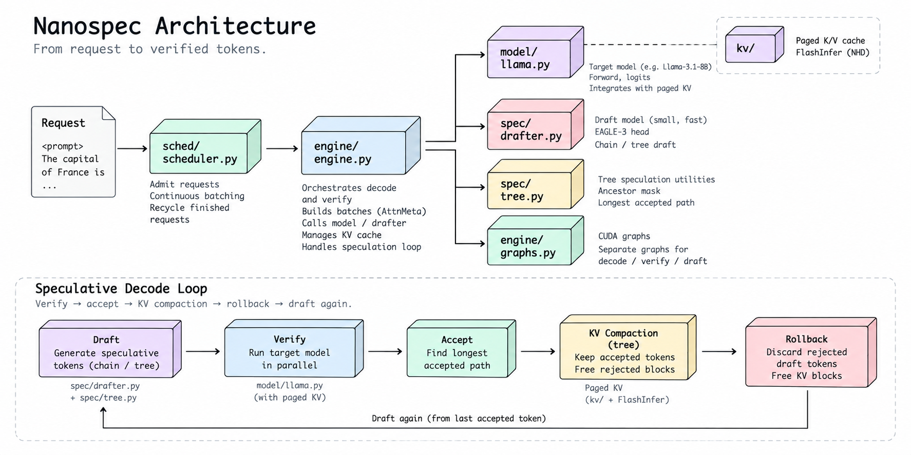

# nanospec

A small inference engine for studying speculative decoding. Paged KV cache, continuous
batching, CUDA graphs, and EAGLE-3 chain/tree speculation in ~3k lines of PyTorch +
FlashInfer. Target model: Llama-3.1-8B-Instruct (bf16) on one H100. Every configuration
produces output byte-identical to plain greedy decoding, and every invariant has a test.




## Setup

```
pip install -e '.[test]'
```

Locally the tests use a 50M Llama (`axolotl-ai-co/tiny-llama-50m`) on MPS/CPU with the
SDPA backend. The H100 runs go through [Modal](https://modal.com): `pip install modal`,
`modal setup`. Weights are cached in the `nanospec-hf-cache` volume; the default model is
the ungated `NousResearch/Meta-Llama-3.1-8B-Instruct` mirror (export `HF_TOKEN` to use
the gated `meta-llama` repo instead).


With SDPA, token equality is strict. With FlashInfer, a divergence is accepted only where
the reference's logit for our token is within 8 bf16 ulps of its best (measured kernel
noise is ~1 ulp/step; `tests/diag_numerics.py` reproduces the measurement). Env knobs:
`NANOSPEC_MODEL`, `NANOSPEC_EAGLE`, `NANOSPEC_DEVICE`, `NANOSPEC_BACKEND` (`auto|sdpa|flashinfer`),
`NANOSPEC_MAX_NEW`.

## Benchmarks

Same prompts (chat-templated MT-Bench), same `max_tokens`, greedy, for nanospec, vLLM, and
SGLang. Configs are `nospec`, `chain` (depth 5, topk 1), and `tree` (depth 5, topk 4).
Each run prints one JSON line per (engine, config, batch size) with output tok/s, TPOT,
and mean accepted length.

```
modal run modal_app.py::bench                                   # all engines × configs, bs 1 8 32, 3 runs
modal run modal_app.py::bench --engines nanospec --configs tree --bs "1 8"
python -m bench.table bench/results/*.jsonl                     # median over runs -> markdown table
```

Results land in `bench/results/<engine>-<config>.jsonl`. vLLM's EAGLE-3 path is
chain-only, so `vllm/tree` is skipped. To run a single engine directly on a GPU box:

```
python -m bench.run nanospec --config tree --bs 1 8 32 --max-tokens 256 --runs 3
python -m bench.run sglang   --config chain
```

### Current numbers

Batch 1, H100, nanospec only, all outputs byte-identical to plain greedy:

| configuration | tok/s | tokens / step | vs no-spec |
|---|---|---|---|
| no speculation + graphs | 137 | 1.00 | 1.00× |
| chain, depth 5 | 252 | 2.88 | 1.83× |
| tree 4 × 5 | 253 | 3.77 | 1.84× |
| tree 6 × 5 | 266 | 3.92 | 1.94× |

Cross-engine table (vs vLLM / SGLang) lands once `modal run modal_app.py::bench` has run
three times on the same commit. See `docs/build-log.md` for the per-phase breakdown.
